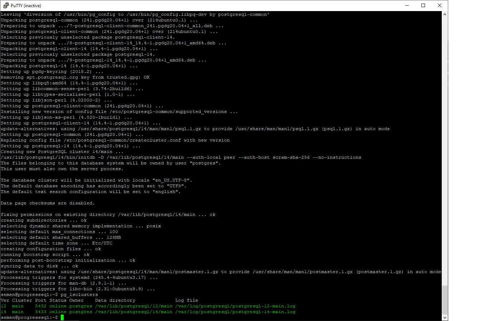
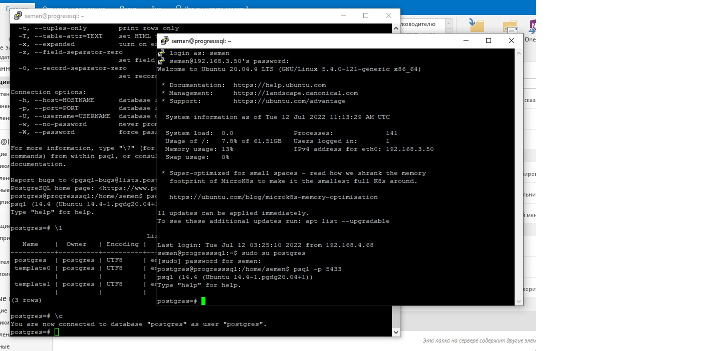

# ДЗ по уроку № 2 Уровни изоляции в PostgreSQL
## Установка Ubuntu и PostgreSQL
Развернул виртуальную машину на рабочей станции своего коллеги. На моей не заработал Hyper-V. Установил Ubuntu 20.04  Установил 12 версию и проивел её апгрейд до 14. Сейчас два установленных кластера: 12-ый и 14-ый.

## Организация двух паралельных сессий с PostgreSQL
При помощи PuTTY подключился к 14-аму Postgres-у два раза. Пришлось использовать ключ -p для выбора порта подключения.

## Демонстрация разницы между read committed и repeatable read

Выключил auto commit в обеих сессиях, что бы самостоятельно управлять завершениями транзакций
```
postgres=# \set AUTOCOMMIT OFF
postgres=# \echo :AUTOCOMMIT
OFF
```

Сделал в первой сессии таблицу persons и наполнил её данными
```
postgres=*# select * from persons;
 id | first_name | second_name
----+------------+-------------
  1 | ivan       | ivanov
  2 | petr       | petrov
```
  
Посмотрел текущий уровень изоляции
```
 transaction_isolation
-----------------------
 read committed
 ```

Начал новую транзакцию в обоих сессиях с дефолтным уровнем изоляции
```
postgres=# begin;
BEGIN
```

В первой сессии добавил запись
```
postgres=*# insert into persons(first_name, second_name) values('sergey', 'sergeev');
INSERT 0 1
postgres=*# select * from persons;
 id | first_name | second_name
----+------------+-------------
  1 | ivan       | ivanov
  2 | petr       | petrov
  3 | sergey     | sergeev
(3 rows)
```

Сделал select к этой таблице во второй сессии
```
postgres=*# select * from persons
postgres-*# ;
 id | first_name | second_name
----+------------+-------------
  1 | ivan       | ivanov
  2 | petr       | petrov
(2 rows)
```

Новую запись мы не видим, так как транзакция в первой сессии не сделала commit внесенным изменениям

Завершил первую транзакцию
```
postgres=*# commit;
COMMIT
```

Cделал select во второй сессии
```
postgres=*# select * from persons
;
 id | first_name | second_name
----+------------+-------------
  1 | ivan       | ivanov
  2 | petr       | petrov
  4 | sergey     | sergeev
(3 rows)
```

Теперь новую запись видно, так как изменения "закоммиччены".

Завершил транзакцию во второй сессии, что бы начать новые, но уже repeatable read в обеих сессиях
```
postgres=# set transaction isolation level repeatable read;
SET
postgres=*# show transaction isolation level
;
 transaction_isolation
-----------------------
 repeatable read
(1 row)
```

В первой сессии добавил новую запись
```
postgres=*# insert into persons(first_name, second_name) values('sveta', 'svetova');
INSERT 0 1
postgres=*# select * from persons;
 id | first_name | second_name
----+------------+-------------
  1 | ivan       | ivanov
  2 | petr       | petrov
  4 | sergey     | sergeev
  5 | sveta      | svetova
(4 rows)
```

Во второй сессии эту строчку не видно
```
postgres=*# select * from persons
;
 id | first_name | second_name
----+------------+-------------
  1 | ivan       | ivanov
  2 | petr       | petrov
  4 | sergey     | sergeev
(3 rows)
```

Это не удивительно и пока повторяется поведение как в read committed

Завершил первую транзакцию
```
postgres=*# commit;
COMMIT
```

Запрос во второй транзакции показывает, что строчки все еще нет.
```
postgres=*# select * from persons
;
 id | first_name | second_name
----+------------+-------------
  1 | ivan       | ivanov
  2 | petr       | petrov
  4 | sergey     | sergeev
(3 rows)
```

Вот это уже отличительная черта. Repeatable read гарантирует, что любые данные, которые данная транзакция считала остануться для неё неизменными до её завершения. Причем все други транзакции будут видеть эти изменения после commit-а первой. Для проверки этого утверждения подключился к postgres из **третьего окна** и выполнил запрос
```
postgres=# select * from persons;
 id | first_name | second_name
----+------------+-------------
  1 | ivan       | ivanov
  2 | petr       | petrov
  4 | sergey     | sergeev
  5 | sveta      | svetova
(4 rows)
```

Видно, что запись со Светой присутсвует. Значит отсутсвует она только во второй транзакции и только потому, что мы до добавления строчки уже считали табличку persons.

Сделал commit во второй сессии
```
postgres=*# commit;
COMMIT
postgres=# select * from persons
;
 id | first_name | second_name
----+------------+-------------
  1 | ivan       | ivanov
  2 | petr       | petrov
  4 | sergey     | sergeev
  5 | sveta      | svetova
(4 rows)
```

Запись появилась, потому что транзакция, для которой держалась копия данных завершилась, а следующая уже должна видеть актуальные данные.
